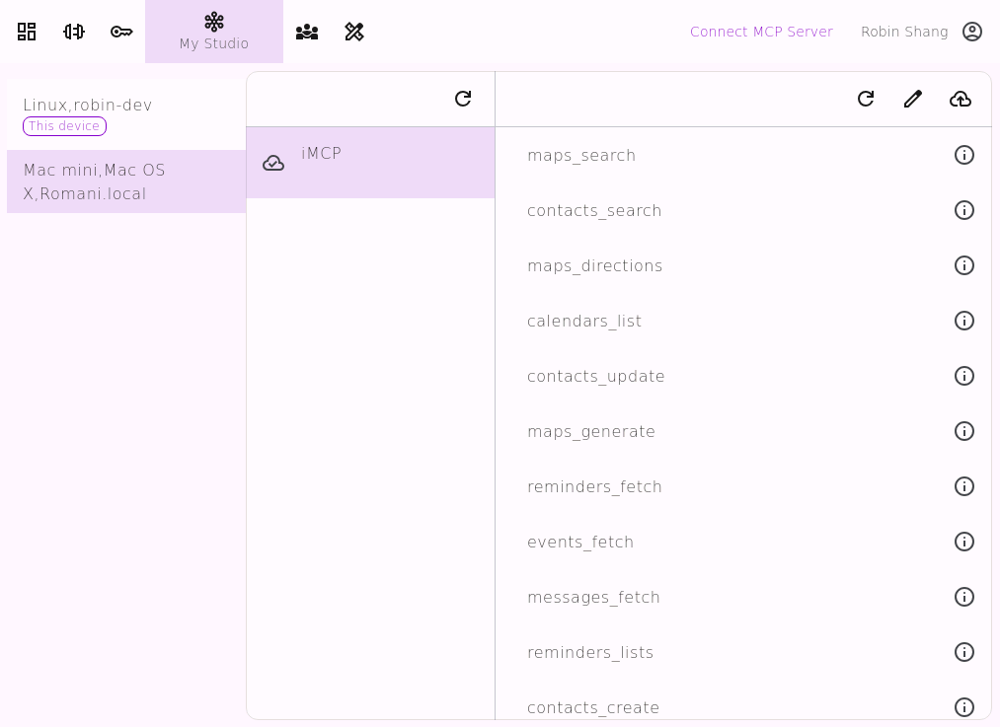

# MCPdirect: Universal MCP Access Gateway
[中文](README.zh-CN.md)
* **Access all your MCP Servers and tools through a single URL**
* **Unified management, unified authorization, and unified access to all your MCP Servers and tools**
* **And easily share your MCP Servers and tools with your team**

---
## What Problems Does MCPdirect Solve?

### 1. AI Agent cannot access MCP Servers running in private spaces (office/home) via the Internet
With MCPdirect, AI Agents can securely access MCP Servers running in private spaces from anywhere

### 2. AI Agent repeatedly configures MCP Servers
In every AI agent, numerous MCP Servers need to be repeatedly configured

Using MCPdirect, you only need to configure once, after which you can access them using a unified URL in any AI agent

### 3. How to share MCP Servers in team collaboration
With MCPdirect, any team member can securely share their MCP Server, and any team member can securely use the shared MCP Server

---
## MCPdirect Usage Scenarios
1. Need to access private environment MCP Servers from the Internet
2. Need to simplify repetitive MCP Server configuration on different MCP Clients
3. Need to customize access permissions for each tool on the MCP Server
4. Need to define accessible MCP tools based on usage scenarios
5. Need to share MCP tools with partners
6. Need to share MCP tools within the team

---
## Features

### Deploy Anywhere, Access Everywhere
* MCP Server can be deployed in any network environment: Home / Office / Mobile Device / Cloud
* MCP Client can access from anywhere: Home / Office / Mobile Device / Cloud

### Flexible Management, Customizable on Demand
* Centrally manage all MCP Server and tool statuses
* Each tool can be individually enabled/disabled for easier testing and isolation
* Virtual MCP Server. Quickly build customized services by logically combining different tool sets
* Team collaboration. Team members can share their MCP Servers and tools with each other
* Maintains existing MCP Server/Client unchanged, enabling smooth upgrades

### Unified Authentication, Fine-grained Authorization
* Create different keys for different user scenarios
* Different keys access different MCP Servers and tool sets
* Grant tool access permissions for each key

---
## How to Use MCPdirect
1. Download/Run MCPdirect Studio
2. Connect some MCP Servers in MCPdirect Studio
3. Create an MCPdirect Key in MCPdirect Studio
4. Authorize the MCPdirect Key to access certain MCP Servers
5. AI Agents access MCP Servers via https://connect.mcpdirect.ai/your_MCPdirect_key/sse or https://connect.mcpdirect.ai/your_MCPdirect_key/mcp

---
## MCPdirect 2.x New Features
* Virtual MCP Server
* MCP Team
* MCP Server Template
* Remote MCP Server Management
* OpenAPI Server as MCP

---

## What is MCPdirect Studio
* MCPdirect Studio is a concentrator for MCP Servers. It can connect to multiple MCP Servers simultaneously and provide unified access through MCPdirect
* MCP Servers connected to MCPdirect Studio can be accessed by AI Agents via https://connect.mcpdirect.ai/your_MCPdirect_key/sse or https://connect.mcpdirect.ai/your_MCPdirect_key/mcp
* MCPdirect Studio can be installed in private environments (office/home) to connect to private MCP Servers
  
---

## MCPdirect Studio Quick Start

### Prerequisites
* Download [MCPdirect Studio](https://github.com/mcpdirect/mcpdirect-studio-app-kmp/releases)

* Register/Login

### Usage
* 

   
  Connect MCP

* 

   
  MCP Key 

* 

   
  My Studios

* 

   
  MCP Team

* 

   
  Virtual MCP

---
#### Connect MCP

---
#### MCP Keys

---
#### My Studio

---
#### MCP Team

---
#### Virtual MCP

