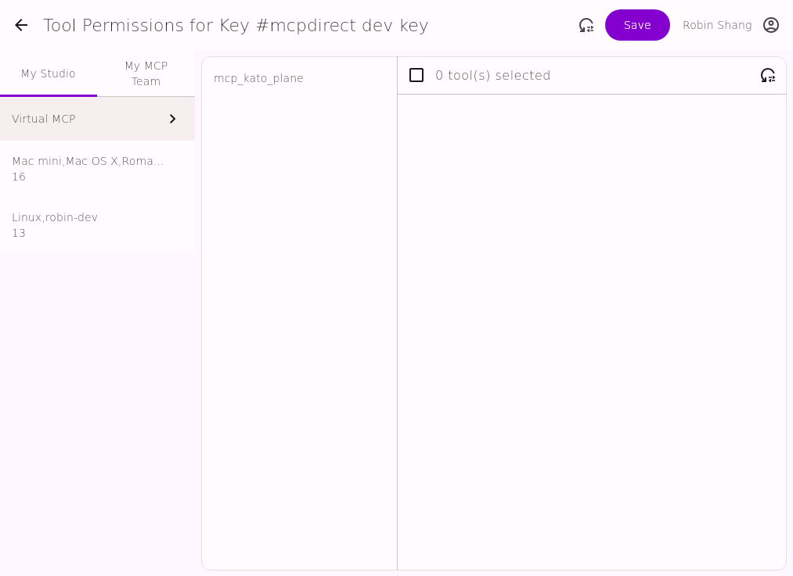
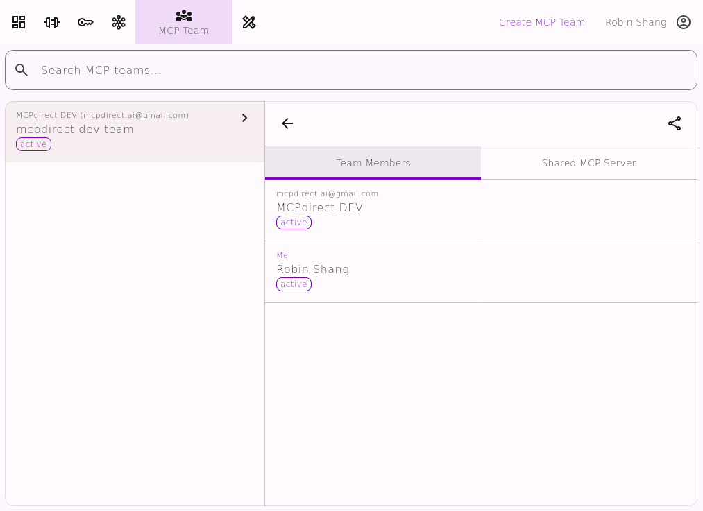

 

---
# MCPDirect: Universal MCP Access Gateway
[中文](README.zh-CN.md)

With MCPdirect, you can centrally manage, authorize, and access all your MCP Servers and tools.

---
## Features

### Deploy Anywhere, Access Everywhere
* MCP Server can be deployed in any network environment: Home / Office / Mobile Device / Cloud
* MCP Client can access from anywhere: Home / Office / Mobile Device / Cloud

### Flexible Management, Customizable on Demand
* Centrally manage all MCP Server and tool statuses
* Each tool can be individually enabled/disabled for easier testing and isolation
* Virtual MCP Server. Quickly build customized services by logically combining different tool sets
* Enhance team collaboration. Team members can share their MCP Servers and tools with each other
* Maintains existing MCP Server/Client unchanged, enabling smooth upgrades

### Unified Authentication, Fine-grained Authorization
* Create different keys for different user scenarios
* Different keys access different MCP Servers and tool sets
* Grant tool access permissions for each key

---
## New Features in MCPdirect 2.0

* Virtual MCP Server
* MCP Team
* Remote MCP Server Management

---
## Quick Start

### Prerequisites
* Download MCPdirect Studio
* Register/Log in

### Usage

   
  Connect MCP

   
  MCP Key

   
  My Studios

   
  MCP Team

   
  Virtual MCP

---
#### Connect MCP

---
#### MCP Keys

---
#### My Studio

---
#### MCP Team

---
#### Virtual MCP

