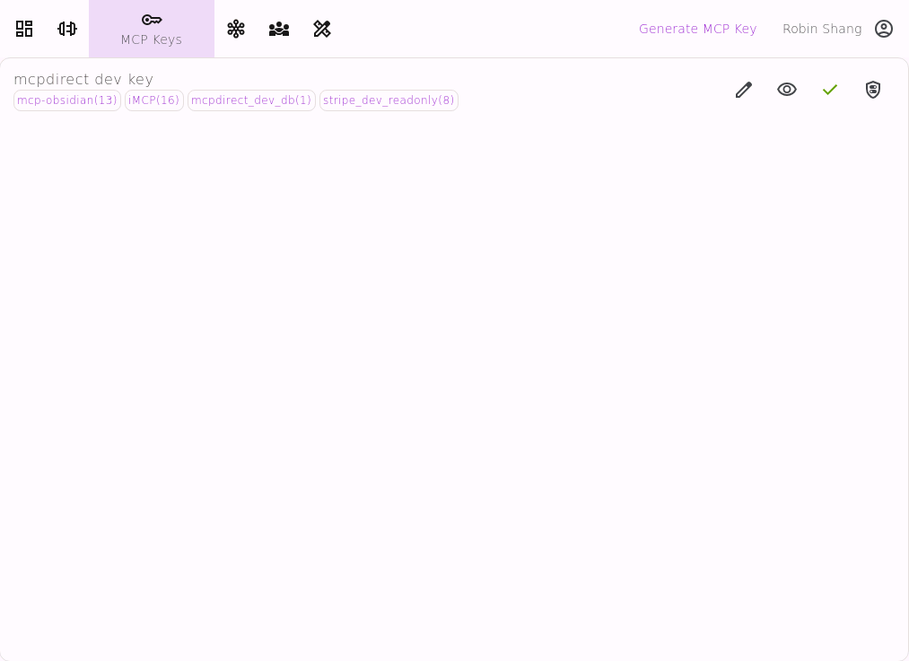
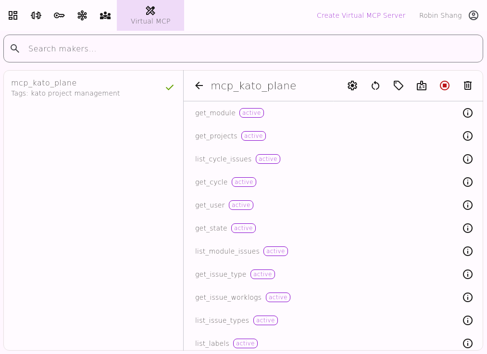

# MCPdirect：通用MCP访问网关
[English](README.md)
* **用一个URL访问你所有的 MCP Server 和工具**
* **统一管理，统一授权，统一访问你所有的MCP Server和工具**
* **并且可以和你的团队分享你的MCP Server 和工具**

---
## MCPdirect解决了哪些问题
### 1. AI Agent重复配置MCP Server
在每一个AI Agent中都需要重复配置之前的众多MCP Server

使用MCPdirect只需要配置一次，之后在任何AI Agent中只需要用统一的URL就可以访问

### 2. AI Agent无法通过Internet访问运行在私有空间(办公室/家)的MCP Server
使用MCPdirect，AI Agent可以从任何地方安全的访问运行在私有空间的MCP Server

### 3. 在团队合作中如何分享MCP Server
使用MCPdirect，任何团队成员都可以安全的分享自己MCP Server，任何团队成员都可以安全的使用分享的MCP Server

---
## MCPdirect适用场景
1. 需要从互联网访问私有环境的MCP Server
2. 需要简化在不同MCP Client上重复配置 MCP Server
3. 需要自定义MCP Server上每个工具的访问权限
4. 需要根据使用场景定义可访问的MCP Server及MCP工具
5. 需要分享MCP工具给个人
6. 需要在团队中共享MCP Server

---
## 特点

### 任意部署，随处访问
* MCP Server 可以部署在任意网络环境： 家庭 / 办公室 / 移动设备 / 云端
* MCP Client 可以从任何地方访问： 家庭 / 办公室 / 移动设备 / 云端
### 灵活管理，按需定制
* 统一管理所有 MCP Server 与工具状态
* 每个工具可单独启用/禁用，便于测试与隔离
* 虚拟 MCP Server。通过逻辑组合不同工具集，快速构建定制化服务
* 这次团队协作。团队成员可以相互分享自己的MCP Server和工具
* 保持现有 MCP Server/Client 不变，平滑升级
### 统一认证，精细授权
* 为不同的用户场景创建不同的 Key
* 不同的 Key 访问不同的 MCP Server 及工具组
* 为每个 Key 授权 Tools 的访问权限

---
## 如何使用MCPdirect
1. 下载/运行MCPdirect Studio
2. 在MCPdirect Studio中连接一些MCP Server
3. 在MCPdirect Studio中创建MCPdirect Key
4. 授权MCPdirect Key访问某些MCP Server
5. AI Agent通过https://connect.mcpdirect.ai/your_MCPdirect_key/sse 或 https://connect.mcpdirect.ai/your_MCPdirect_key/mcp 访问MCP Server

---
## MCPdirect 2.0 新功能
* Virtual MCP Server
* MCP Team
* 远程管理 MCP Server

---

## MCPdirect Studio是什么
* MCPdirect Studio是一个MCP Server的集中器。可以同时连接多个MCP Server，并通过MCPdirect统一访问
* 连接到 MCPdirect Studio 上的 MCP Server，都可以通过 https://connect.mcpdirect.ai/your_MCPdirect_key/sse 或 https://connect.mcpdirect.ai/your_MCPdirect_key/mcp 被AI Agent访问到
* MCPdirect Studio允许安装在私有环境中(办公室/家)，连接私有的MCP Server

---

## MCPdirect Studio快速入门

### 准备
* 下载 [MCPdirect Studio](https://github.com/mcpdirect/mcpdirect-studio-app-kmp/releases)

* 注册/登录

### 使用
* 

   
  Connect MCP

* 

   
  MCP Key 

* 

   
  My Studios

* 

   
  MCP Team

* 

   
  Virtual MCP

---
#### Connect MCP

---
#### MCP Keys

---
#### My Studio

---
#### MCP Team

---
#### Virtual MCP

