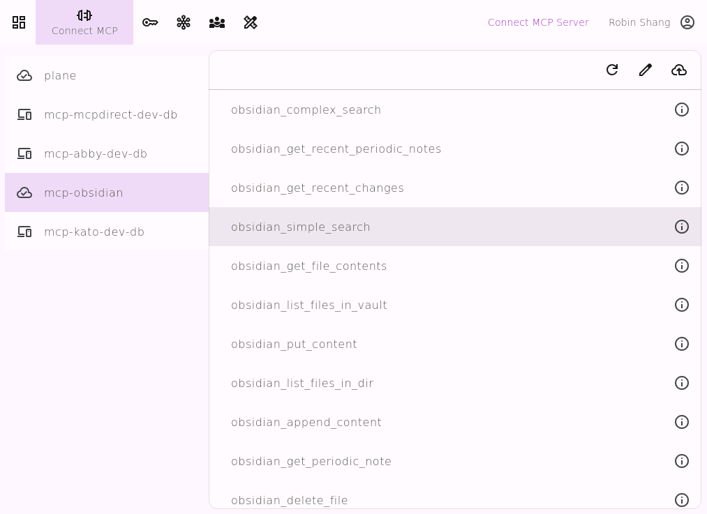
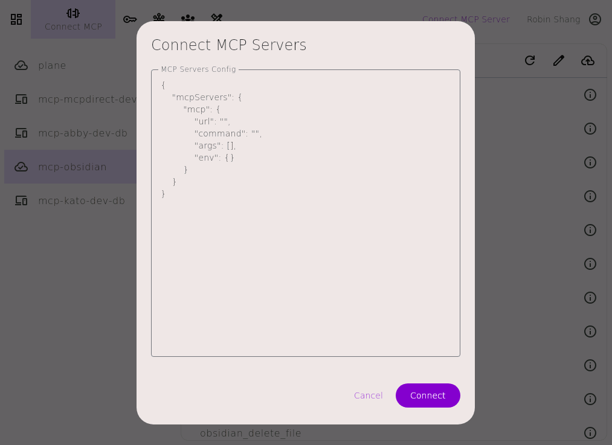

 

---
# MCPDirect：通用MCP访问网关
* **用一个URL访问你所有的 MCP Server 和工具**
* **统一管理，统一授权，统一访问你所有的MCP Server和工具**
* **并且可以和你的团队分享你的MCP Server 和工具**

---
## 特点

### 任意部署，随处访问
* MCP Server 可以部署在任意网络环境： 家庭 / 办公室 / 移动设备 / 云端
* MCP Client 可以从任何地方访问： 家庭 / 办公室 / 移动设备 / 云端
### 灵活管理，按需定制
* 统一管理所有 MCP Server 与工具状态
* 每个工具可单独启用/禁用，便于测试与隔离
* 虚拟 MCP Server。通过逻辑组合不同工具集，快速构建定制化服务
* 这次团队协作。团队成员可以相互分享自己的MCP Server和工具
* 保持现有 MCP Server/Client 不变，平滑升级
### 统一认证，精细授权
* 为不同的用户场景创建不同的 Key
* 不同的 Key 访问不同的 MCP Server 及工具组
* 为每个 Key 授权 Tools 的访问权限

---
## MCPdirect 2.0 新功能

* Virtual MCP Server
* MCP Team
* 远程管理 MCP Server

---
## 快速入门

### 准备
* 下载 [MCPdirect Studio](https://github.com/mcpdirect/mcpdirect-studio-app-kmp/releases)
* 注册/登录

### 使用
* 

   
  Connect MCP

* 

   
  MCP Key 

* 

   
  My Studios

* 

   
  MCP Team

* 

   
  Virtual MCP

---
#### Connect MCP

---
#### MCP Keys

---
#### My Studio

---
#### MCP Team

---
#### Virtual MCP

